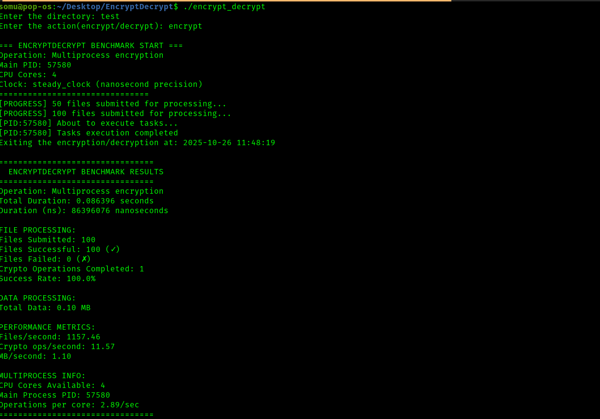
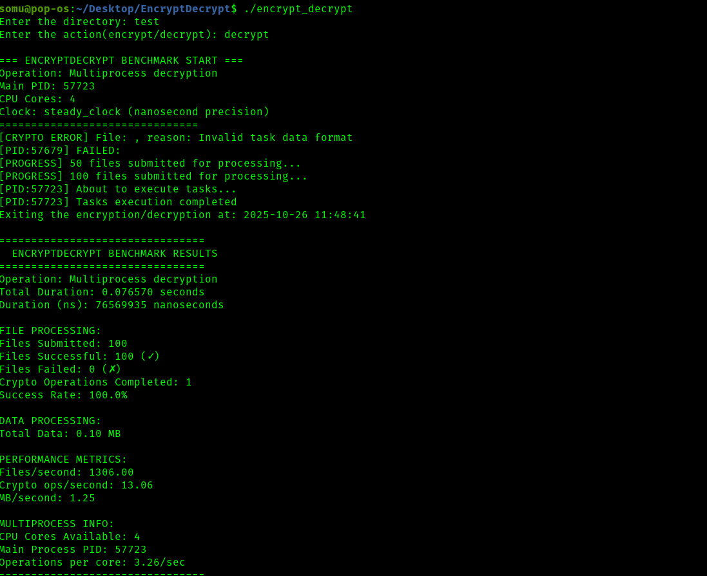
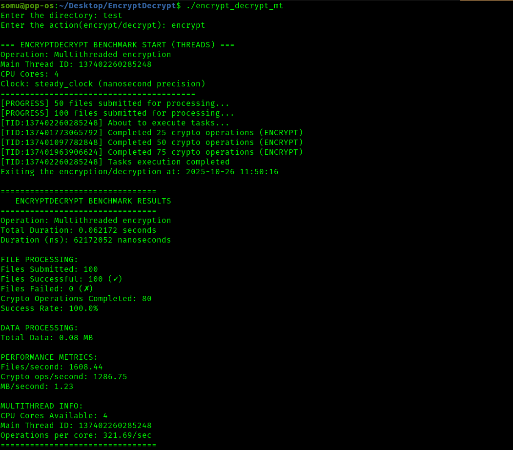
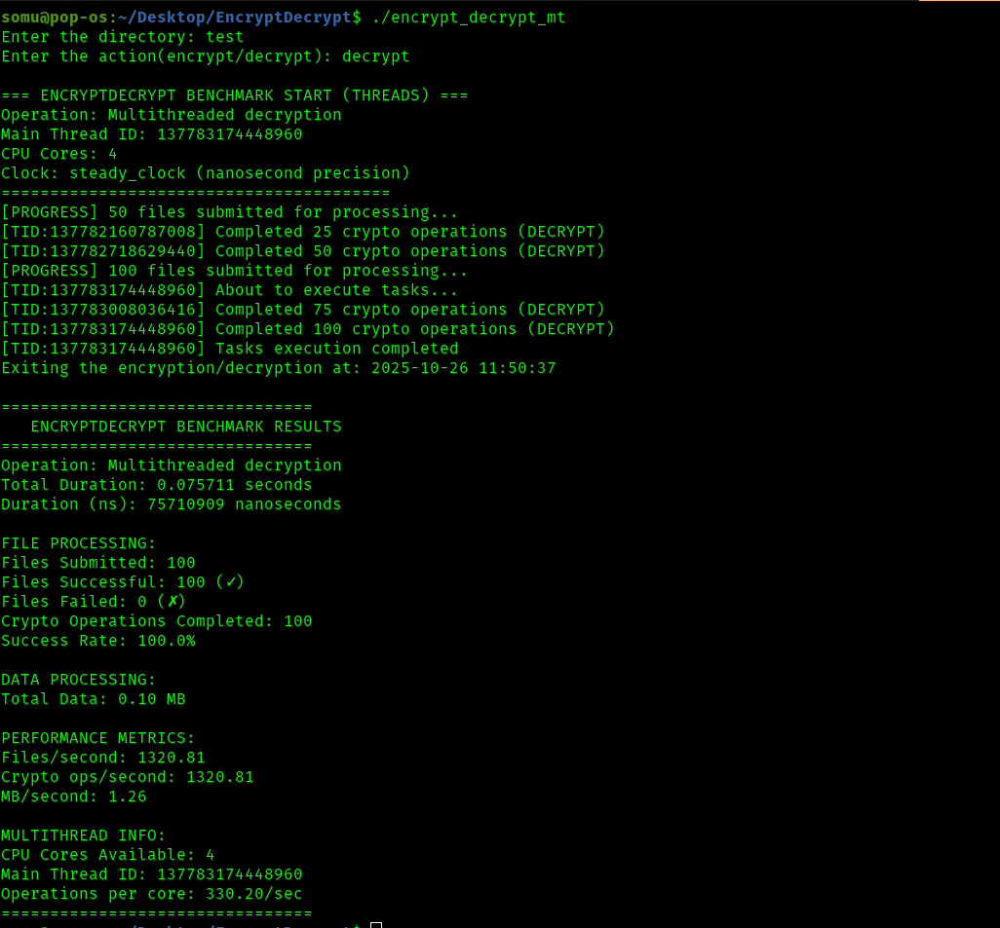

# Your Parallel Encryption and Decryption

## Overview

This project demonstrates the implementation of encryption and decryption mechanisms using parallel processing techniques in C++. By leveraging both multiprocessing and multithreading, the project aims to enhance the efficiency and performance of cryptographic operations.

## Branches

The repository contains two primary branches, each focusing on a distinct parallel processing approach:

### 1. `add/childProcessing`

**Description:** This branch showcases the use of parallel multiprocessing by creating child processes to handle encryption and decryption tasks. It utilizes the `fork()` system call to spawn child processes, enabling concurrent execution of tasks.

**Key Features:**

- **Process Management:** Implements process creation and management using `fork()`.
- **Task Queue:** Manages encryption and decryption tasks using a queue structure.
- **Task Execution:** Child processes execute tasks independently, allowing parallel processing.

### 2. `add/multithreading`

**Description:** This branch focuses on multithreading combined with shared memory to perform encryption and decryption. It employs POSIX threads (`pthread`) and utilizes shared memory segments for efficient inter-thread communication.

**Key Features:**

- **Multithreading:** Implements concurrent execution using POSIX threads.
- **Shared Memory:** Utilizes shared memory for communication between threads.
- **Semaphores:** Employs semaphores to manage synchronization and ensure data consistency.

## Benchmark Results

All timing and benchmarking is done using C++’s <chrono> library for high-precision measurement.

Here is a screenshot of the benchmark output:






## Future Scope

Support Multiple Encryption Algorithms-
Allow users to choose from different encryption standards (e.g., AES, ChaCha20, RSA) to balance performance and security requirements.

GPU Acceleration-
Offload heavy cryptographic operations to GPUs using CUDA or OpenCL to dramatically speed up processing of large datasets.


## Getting Started

To explore the implementations in each branch:

   ```bash
   git clone <repo-url>
   cd EncryptDecrypt
   git checkout <branch>
   # Now make a virtual env and activate
   python -m venv /myvenv
   source myvenv/bin/activate
   python makeDirs.py
   make all
   # In case of MultiProcessing
   ./encrypty_decrypt
   # In case of MultiThreading
   ./encrypty_decrypt_mt
   # type directory name which is created from makeDirs.py
   test
   ENCRYPT # after giving directory name, give ENCRYPT or DECRYPT to tell what to do
   ```
