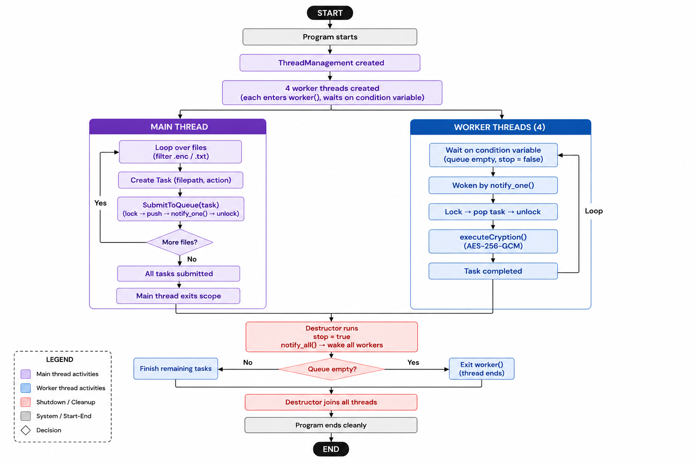

# EncryptDecrypt — Parallel File Encryption and Decryption System

## Overview

This project implements a high-performance parallel file encryption and decryption system in modern C++ using AES-256-GCM authenticated encryption.

The system explores both multiprocessing and multithreading approaches for concurrent cryptographic execution, with emphasis on:

- Parallel task distribution
- Thread-safe synchronization
- RAII-based resource management
- Benchmarking and performance analysis
- Secure AES-256-GCM encryption using OpenSSL EVP APIs

The project demonstrates practical operating systems concepts including:

- Thread pools
- Shared memory IPC
- Mutexes and condition variables
- POSIX semaphores
- Synchronization and workload distribution

---

## Branches

The repository contains two different parallel execution approaches.

---

### 1. `MultiProcessing`

**Description:**  
This implementation uses process-based parallelism through the `fork()` system call.  
Child processes independently execute encryption and decryption tasks using shared-memory-based IPC communication.

**Key Features:**

- Process creation using `fork()`
- Shared memory communication using `mmap`
- POSIX semaphores for synchronization
- Parallel task execution across processes
- IPC-based task queue management

---

### 2. `Multithreading`

**Description:**  
This implementation uses a thread-pool based concurrent execution model built with modern C++ threading primitives. Worker threads continuously fetch tasks from a thread-safe queue and process encryption/decryption jobs in parallel.

**Key Features:**

- Thread Pool Architecture using `std::thread`
- Thread-safe task queue using `std::queue`
- Synchronization using `std::mutex` and `std::condition_variable`
- Low-overhead concurrent execution
- RAII-based automatic resource cleanup
- Efficient multicore CPU utilization

---

## Encryption Pipeline

The system uses AES-256-GCM authenticated encryption implemented through OpenSSL’s EVP interface.

### Security Features

- AES-256-GCM authenticated encryption
- PBKDF2-HMAC-SHA256 key derivation
- Per-file random salt generation
- Per-file random IV generation
- Authentication tag verification during decryption

### Execution Flow

1. File is opened using RAII-managed file streams
2. File contents are read into memory
3. Salt and IV are generated
4. Key is derived using PBKDF2-HMAC-SHA256
5. AES-256-GCM encryption/decryption is performed
6. Authentication tag is verified during decryption
7. Output file is securely written
8. Resources are automatically cleaned up

---

## System Architecture

The following diagram illustrates the multithreaded execution pipeline used in the project.

The architecture includes:

- Thread pool based task execution
- Thread-safe task queue
- Condition-variable based synchronization
- RAII-managed file I/O
- AES-256-GCM encryption/decryption pipeline

<p align="center">
  
</p>

---

## Activity Diagram

The following activity diagram represents the lifecycle of the multithreaded execution model.

<p align="center">
  
</p>

---

## Benchmark Results

All benchmarks were measured using C++17 `std::chrono::steady_clock`
with a dataset of 1000 files.

### Performance Comparison

| Metric | Multiprocessing | Multithreading |
|---|---|---|
| Encryption Time (s) | 14.05 | 12.45 |
| Decryption Time (s) | 14.57 | 12.69 |
| Encryption Throughput (files/sec) | 71.16 | 80.27 |
| Decryption Throughput (files/sec) | ~72.00 | 78.76 |
| Correctness | 98.8% | 100% |
| Synchronization Overhead | High | Low |
| Implementation Complexity | High | Moderate |

---

### Comparison with Existing Tools

| Tool / System | Time for 1000 Files | Throughput (files/sec) |
|---|---|---|
| OpenSSL CLI | 56.20 s | 17.79 |
| GPG (AES256) | 162.68 s | 6.14 |
| Proposed Multithreading System | 12.45 s | 80.27 |

The multithreaded implementation achieved the best overall throughput due to:

- Lower synchronization overhead
- Lightweight thread scheduling
- Efficient thread-pool based execution
- Better CPU core utilization

---

## Technologies Used

- C++17
- OpenSSL EVP API
- AES-256-GCM
- PBKDF2-HMAC-SHA256
- POSIX Threads
- POSIX Shared Memory
- POSIX Semaphores
- `std::thread`
- `std::mutex`
- `std::condition_variable`
- RAII-based resource management
- C++17 `<chrono>` benchmarking

---

## Getting Started

Clone the repository:

```bash
git clone <repo-url>
cd EncryptDecrypt
```

---

### Build Setup

```bash
# Create build directory
mkdir build

# Create .env file
touch .env

# Create Python virtual environment
python -m venv myvenv

# Activate virtual environment
source myvenv/bin/activate

# Generate test dataset
python3 makeDirs.py

# Build project
make all
```

---

### Run Multiprocessing Version

```bash
./build/encrypt_decrypt
```

---

### Run Multithreading Version

```bash
./build/encrypt_decrypt_mt
```

---

### Input Example

```text
Enter the directory:
test

Enter the action(encrypt/decrypt):
encrypt
```

---

## Future Scope

- Support additional encryption algorithms such as ChaCha20 and RSA
- GPU acceleration using CUDA or OpenCL
- Dynamic workload balancing strategies
- Real-time encryption progress monitoring
- Cross-platform optimization for Windows and macOS
- Distributed encryption across multiple machines

---

## License

This project is licensed under the [MIT License](./LICENSE) © 2025 Soumalya Karak.

---

⭐ If you found this project useful, consider giving it a star.