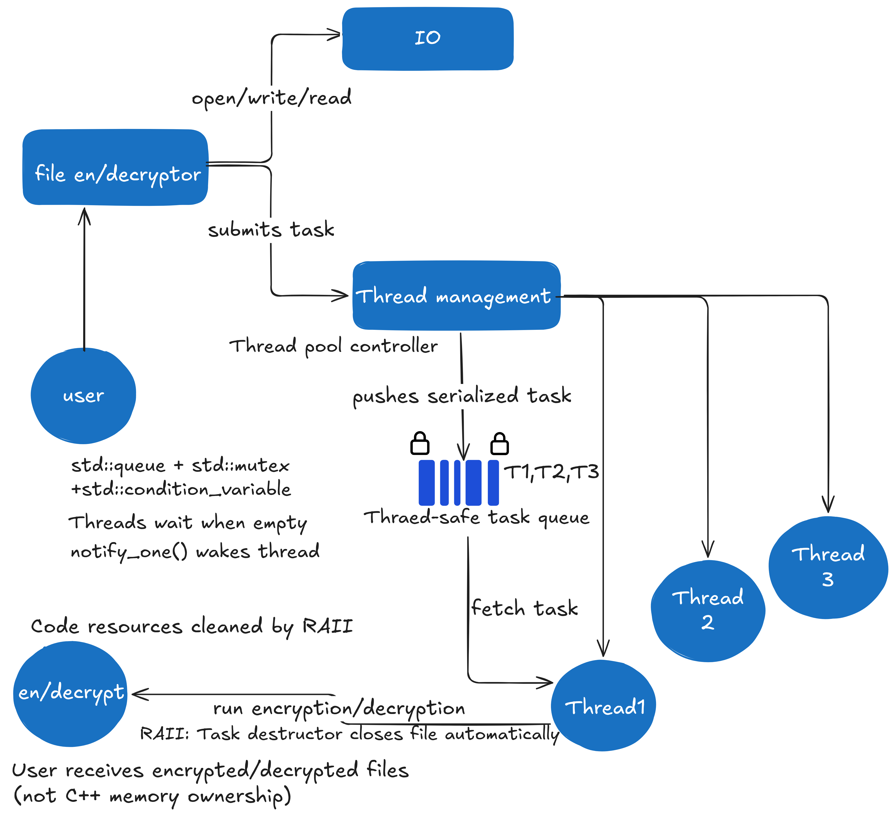

# EncryptDecrypt — Concurrent File Encryption and Decryption System

## Overview

EncryptDecrypt is a high-performance concurrent file encryption and decryption system built in modern C++.

The project explores both multiprocessing and multithreading approaches for parallel cryptographic execution using AES-256-GCM authenticated encryption with OpenSSL.

Key highlights include:

- Parallel file encryption/decryption
- AES-256-GCM authenticated encryption
- Multiprocessing and multithreading implementations
- Thread-safe task management
- RAII-based resource handling
- Benchmarking and performance analysis

---

## Branches

The repository contains two different parallel execution approaches.

### 1. `MultiProcessing`

Uses process-based parallelism through the `fork()` system call with shared-memory-based IPC communication.

**Features**
- Process-based execution
- Shared memory communication
- POSIX semaphores
- Parallel task execution


### 2. `Multithreading`

Uses a thread-pool based execution model built with modern C++ threading primitives.

**Features**
- Thread pool architecture
- Thread-safe task queue
- `std::mutex` and `std::condition_variable`
- Low-overhead concurrent execution
- Efficient multicore CPU utilization


## System Architecture

The following diagram illustrates the multithreaded execution pipeline used in the project.

<p align="center">
  
</p>


## Benchmark Results

All benchmarks were measured using C++17 `std::chrono::steady_clock`
with a dataset of 1000 files.

### Performance Comparison

| Metric | Multiprocessing | Multithreading |
|---|---|---|
| Encryption Time (s) | 14.05 | 12.45 |
| Decryption Time (s) | 14.57 | 12.69 |
| Encryption Throughput (files/sec) | 71.16 | 80.27 |
| Decryption Throughput (files/sec) | ~72.00 | 78.76 |
| Correctness | 98.8% | 100% |
| Synchronization Overhead | High | Low |


### Comparison with Existing Tools

| Tool / System | Time for 1000 Files | Throughput (files/sec) |
|---|---|---|
| OpenSSL CLI | 56.20 s | 17.79 |
| GPG (AES256) | 162.68 s | 6.14 |
| Proposed Multithreading System | 12.45 s | 80.27 |

The multithreaded implementation achieved the highest throughput due to lightweight synchronization and efficient thread-pool execution.


## Technologies Used

- C++17
- OpenSSL EVP API
- AES-256-GCM
- POSIX Threads
- POSIX Shared Memory
- POSIX Semaphores
- `std::thread`
- `std::mutex`
- `std::condition_variable`

### Install Dependencies

```bash
sudo apt update
sudo apt install build-essential libssl-dev python3 python3-venv
```

## Getting Started

Clone the repository:

```bash
git clone https://github.com/Soumalyakarak/EncryptDecrypt.git
cd EncryptDecrypt

# Switch to stable implementation branch
git checkout v1/EncryptDecrypt
```


### Build Setup

```bash
# Create build directory
mkdir build

# Create .env file
touch .env

# Add encryption key
echo "KEY=your_secret_key" >> .env

# Create Python virtual environment
python3 -m venv myvenv

# Activate virtual environment
source myvenv/bin/activate

# Generate test dataset
python3 makeDirs.py

# Build project
make all
```


### Run Multiprocessing Version

```bash
./build/encrypt_decrypt
```


### Run Multithreading Version

```bash
./build/encrypt_decrypt_mt
```


### Input Example

```text
Enter the directory:
test

Enter the action(encrypt/decrypt):
encrypt
```


## Future Scope

- GPU acceleration using CUDA or OpenCL
- Support for additional encryption algorithms
- Dynamic workload balancing
- Distributed encryption support
- Cross-platform optimization


## License

This project is licensed under the [MIT License](./LICENSE) © 2025 Soumalya Karak

⭐ If you found this project useful, consider giving it a star.